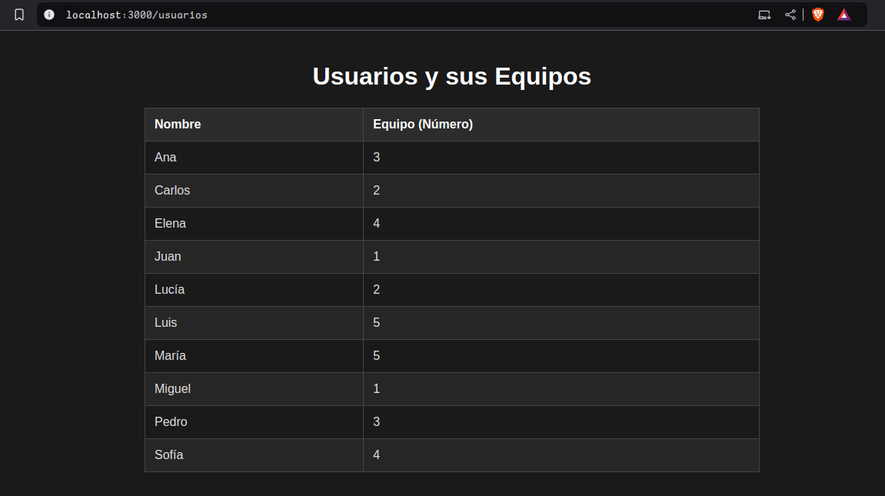

# Project Documentation

## Overview

This project consists of a Django backend and a React frontend, where the backend handles the server-side logic, and the frontend renders the user interface with routing.

- **Backend**: Django framework for managing routes, data, and rendering views.
- **Frontend**: React framework with React Router for handling navigation between pages.


## Demo

Ranking Page


Usuarios Page


---

## Backend - Django

### Setting Up

1. **Install dependencies**:
    ```bash
    pip install -r requirements.txt
    ```
2. **Run migrations**:
    ```bash
    python manage.py makemigrations
    python manage.py migrate
    ```
3. **Create a superuser**:
    ```bash
    python manage.py createsuperuser
    ```
4. **Run the server**:
    ```bash
    python manage.py runserver
    ```

### API Endpoints

GET `admin/` - Admin panel for managing the database.
GET `ranking/` - List of all players with their scores ordered by score and time of last submission.
GET `usuarios/` - List of all users and the groups they belong to.

---

## Frontend - React

### Setting Up

1. **Install dependencies**:
    ```bash
    npm install
    ```
2. **Run the server**:
    ```bash
    npm start
    ```
3. **Open the browser**:
    ```bash
    http://localhost:3000
    ```

### Routes

- `/ranking` - List of all players with their scores ordered by score and time of last submission.
- `/usuarios` - List of all users and the groups they belong to.

---

